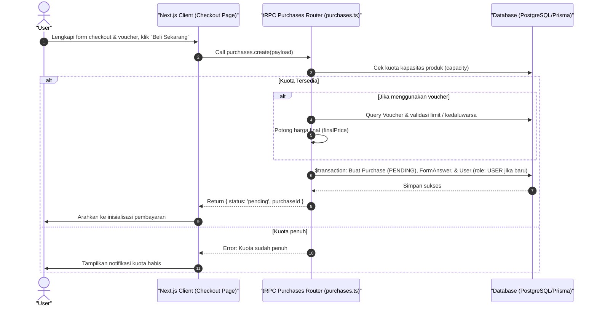

# Sequence Diagram - Daftar / Checkout (Pembeli)

Diagram ini menjelaskan alur kasus penggunaan (use case) ke-46: **Daftar / Checkout (Pembeli)** pada platform CuanIN.

### Detail Langkah / Deskripsi Alur:
User mengisi informasi nama, email, kuesioner kustom, voucher diskon, dan mengajukan checkout pesanan.
