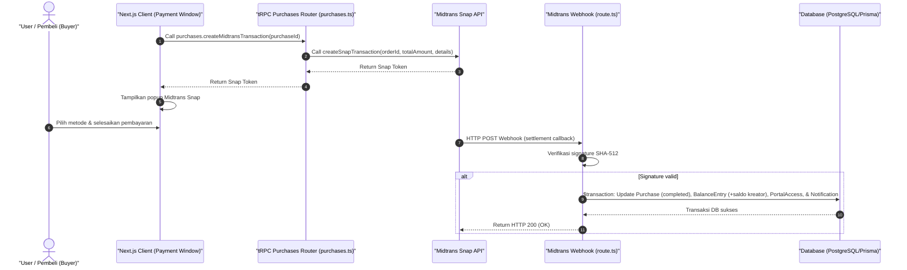

# Sequence Diagram - Bayar (Pembeli)

Diagram ini menjelaskan alur kasus penggunaan (use case) ke-47: **Bayar (Pembeli)** pada platform CuanIN.

### Detail Langkah / Deskripsi Alur:
Pembeli membayar tagihan via Midtrans Snap, memicu pembaruan status transaksi & saldo kreator via webhook.
