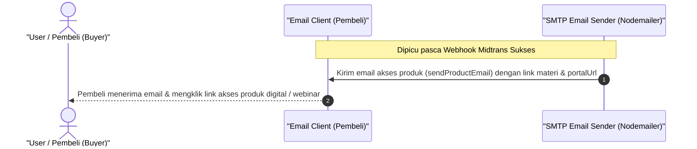

# Sequence Diagram - Akses Produk Lewat Email (Pembeli)

Diagram ini menjelaskan alur kasus penggunaan (use case) ke-48: **Akses Produk Lewat Email (Pembeli)** pada platform CuanIN.

### Detail Langkah / Deskripsi Alur:
Pembeli mendapatkan surat elektronik berisi tautan materi produk digital atau tiket webinar secara otomatis.
