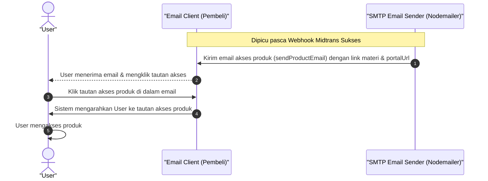

# Sequence Diagram - Akses Produk Lewat Email (Pembeli)

Diagram ini menjelaskan alur kasus penggunaan (use case) ke-48: **Akses Produk Lewat Email (Pembeli)** pada platform CuanIN.

### Detail Langkah / Deskripsi Alur:

**User Akses Produk Lewat Email**
- **Aktor:** User
- **Kondisi Awal:** User sudah melakukan pembayaran dan menerima email.
- **Kondisi Akhir:** User berhasil mengakses produk melalui email.

**Skenario Utama:**
1. User buka email dan klik tautan akses.
2. Sistem mengarahkan User ke tautan akses produk.
3. User mengakses produk.
