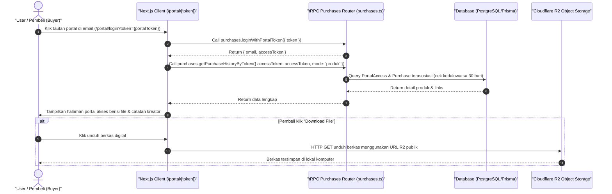

# Sequence Diagram - Akses Produk Lewat Portal (Pembeli)

Diagram ini menjelaskan alur kasus penggunaan (use case) ke-49: **Akses Produk Lewat Portal (Pembeli)** pada platform CuanIN.

### Detail Langkah / Deskripsi Alur:
Pembeli masuk ke portal akses terpusat untuk melihat tautan file dan mengunduhnya langsung dari R2.
