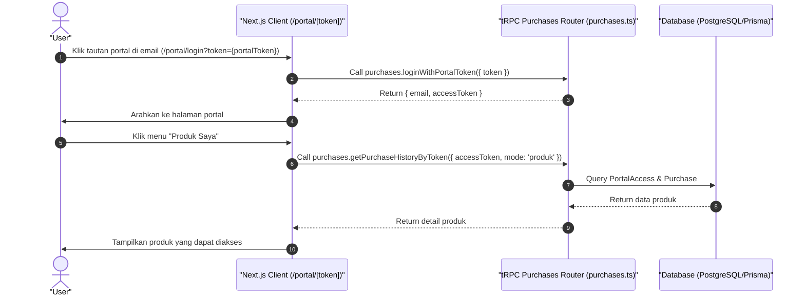

# Sequence Diagram - Akses Produk Lewat Portal (Pembeli)

Diagram ini menjelaskan alur kasus penggunaan (use case) ke-49: **Akses Produk Lewat Portal (Pembeli)** pada platform CuanIN.

### Detail Langkah / Deskripsi Alur:

**User Akses Produk Lewat Portal**
- **Aktor:** User
- **Kondisi Awal:**
  1. User sudah melakukan pembayaran dan menerima email.
  2. Portal akses diaktifkan oleh Kreator/pemilik produk.
  3. User berada di halaman toko (akses lewat tautan portal di email).
- **Kondisi Akhir:** User berhasil mengakses produk melalui portal.

**Skenario Utama:**
1. Jika lewat email/token, User dapat klik tautan portal pada email tersebut.
2. Setelahnya User akan diarahkan ke halaman portal.
3. User dapat mengakses produk melalui menu Produk Saya.
