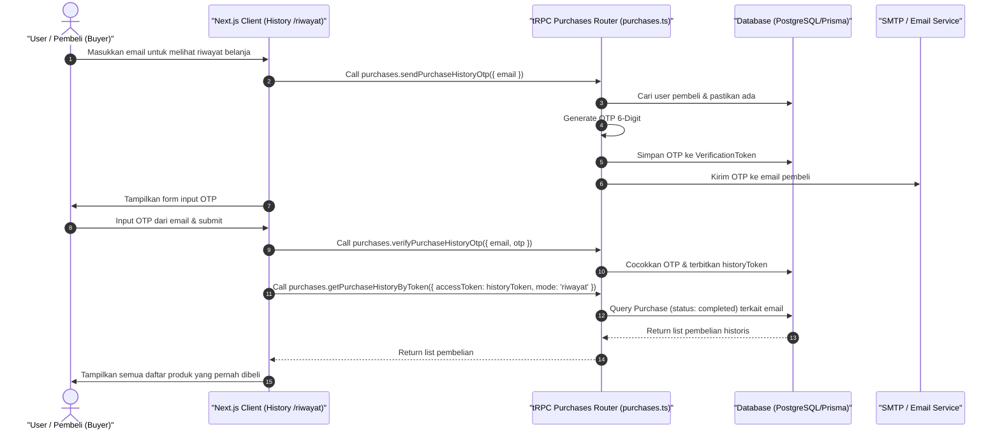

# Sequence Diagram - Lihat Riwayat Pembelian (Pembeli)

Diagram ini menjelaskan alur kasus penggunaan (use case) ke-50: **Lihat Riwayat Pembelian (Pembeli)** pada platform CuanIN.

### Detail Langkah / Deskripsi Alur:
Pembeli melihat log riwayat seluruh transaksi pembelanjaan sukses miliknya diamankan verifikasi OTP.
