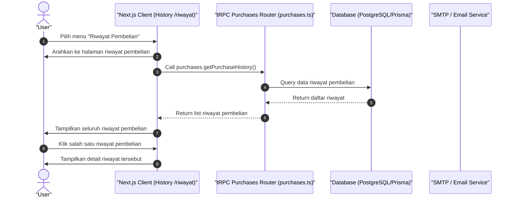

# Sequence Diagram - Lihat Riwayat Pembelian (Pembeli)

Diagram ini menjelaskan alur kasus penggunaan (use case) ke-50: **Lihat Riwayat Pembelian (Pembeli)** pada platform CuanIN.

### Detail Langkah / Deskripsi Alur:

**User Lihat Riwayat Pembelian**
- **Aktor:** User
- **Kondisi Awal:**
  1. User sudah melakukan pembelian.
  2. User sudah berada di halaman portal pelanggan.
- **Kondisi Akhir:** User berhasil melihat riwayat pembelian.

**Skenario Utama:**
1. User memilih "riwayat pembelian" pada menu.
2. Sistem mengarahkan User ke halaman riwayat pembelian.
3. User dapat melihat seluruh riwayat pembelian dan dapat melihat detailnya.
