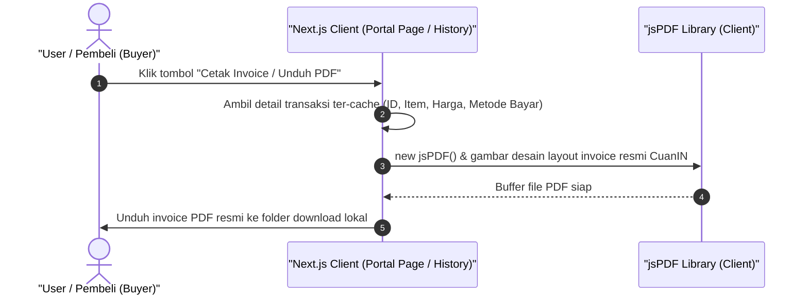

# Sequence Diagram - Cetak Invoice (Pembeli)

Diagram ini menjelaskan alur kasus penggunaan (use case) ke-51: **Cetak Invoice (Pembeli)** pada platform CuanIN.

### Detail Langkah / Deskripsi Alur:
Pembeli mencetak / mengunduh dokumen invoice digital berformat PDF sebagai tanda bukti lunas.
