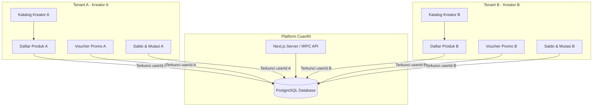

# Konsep Multi-Tenant dan Peran (Roles) di CuanIN

Dokumen ini menjelaskan arsitektur **Multi-Tenancy** dan pembagian peran (**Role-Based Access Control / RBAC**) yang diimplementasikan pada platform **CuanIN**. Panduan ini disusun sebagai referensi teknis untuk memahami bagaimana sistem mengisolasi data antar-kreator (tenant) serta bagaimana hak akses dibatasi berdasarkan tipe pengguna.

---

## 1. Konsep Multi-Tenancy di CuanIN

**Multi-Tenancy** adalah arsitektur perangkat lunak di mana satu instansi aplikasi melayani banyak pelanggan atau penyewa (**Tenant**). Di dalam platform CuanIN:

- **Tenant** adalah para **Kreator** (pengguna dengan role `CREATOR`).
- **Model Tenancy**: CuanIN menggunakan model **Shared Database, Logical Isolation** (Database Bersama, Isolasi Logis). Semua data tenant disimpan dalam database PostgreSQL yang sama, tetapi dipisahkan secara logis menggunakan filter kolom relasional (biasanya `userId` atau `creatorId`).

Setiap Kreator memiliki "toko" atau etalase digital tersendiri yang disebut **Katalog** dengan slug URL unik (misal: `cuanin.com/catalog/[slug]`). Produk yang mereka buat, voucher promo yang mereka terbitkan, dan saldo pendapatan yang mereka kumpulkan terisolasi secara aman dari kreator (tenant) lainnya.



---

## 2. Diferensiasi Peran (Role Differentiation)

Aksesibilitas dan fungsionalitas pengguna di CuanIN diatur oleh tipe peran (`RoleType`) yang didefinisikan 	pada skema database. Terdapat tiga role utama:	

```prisma
enum RoleType {
  CREATOR
  ADMIN
  USER
}
```

Berikut adalah perbandingan peran dan tanggung jawab masing-masing role:

| Fitur / Hak Akses          | **CREATOR** (Tenant)                                                          | **USER** (Buyer / Pembeli)                                       | **ADMIN** (Platform Operator)                                |
| :------------------------- | :---------------------------------------------------------------------------------- | :--------------------------------------------------------------------- | :----------------------------------------------------------------- |
| **Deskripsi**        | Penyewa platform (kreator) yang menjual produk digital, kelas online, atau webinar. | Pelanggan/pembeli yang melakukan transaksi produk milik kreator.       | Pengelola platform CuanIN yang mengawasi seluruh aktivitas sistem. |
| **Workspace Utama**  | Dashboard Kreator (`/dashboard`)                                                  | Portal Akses Pembeli (`/portal/dashboard`)                           | Admin Panel (`/admin/dashboard`)                                 |
| **Registrasi**       | Melalui halaman`/sign-up` (pendaftaran mandiri).                                  | Dibuat otomatis saat checkout jika belum terdaftar.                    | Ditentukan manual di database.                                     |
| **Manajemen Produk** | **Ya** (Bisa create, read, update, delete produk sendiri).                    | **Tidak** (Hanya bisa membeli dan mengakses produk yang dibeli). | **Ya** (Membaca semua produk secara global untuk moderasi).  |
| **Katalog Toko**     | **Ya** (Memiliki 1 katalog etalase privat).                                   | **Tidak** (Hanya dapat melihat katalog kreator).                 | **Tidak** (Tidak memiliki katalog).                          |
| **Keuangan**         | Mengelola saldo penjualan & pengajuan pencairan dana (*Withdrawal*).              | Tidak memiliki saldo (hanya melakukan pembayaran).                     | Memantau seluruh aliran dana, memproses transaksi platform fee.    |
| **Notifikasi**       | Menerima notifikasi penjualan real-time via Pusher & email.                         | Menerima email berisi akses portal dan invoice PDF.                    | Menerima log kesalahan atau notifikasi sistem secara internal.     |

---

## 3. Implementasi Teknis Isolasi Tenant

Isolasi data antar-tenant (kreator) dan hak akses diimplementasikan pada beberapa lapisan sistem CuanIN:

### A. Lapisan Database (Skema Relasional)

Pada skema Prisma (`prisma/schema.prisma`), relasi tabel-tabel utama seperti `Product`, `Catalog`, `Voucher`, dan `Withdrawal` selalu mengikat kunci asing `userId` yang merujuk pada model `User`:

```prisma
model User {
  id             String         @id @default(cuid())
  email          String?        @unique
  role           RoleType       @default(USER)
  catalog        Catalog?
  products       Product[]
  withdrawals    Withdrawal[]
  balanceEntries BalanceEntry[]
  vouchers       Voucher[]
  portalAccesses PortalAccess[]
  // ...
}

model Product {
  id               String        @id @default(uuid())
  name             String
  userId           String
  user             User          @relation(fields: [userId], references: [id], onDelete: Cascade)
  // ...
}
```

### B. Lapisan Prosedur tRPC (API Layer)

Otorisasi pemanggilan API diatur di berkas [trpc.ts](file:///home/luputer/Dokumen/TA/CuanIN/src/server/api/trpc.ts) dengan mendefinisikan beberapa middleware prosedur:

1. **`publicProcedure`**: Dapat dipanggil tanpa login (misal: memuat katalog publik kreator).
2. **`protectedProcedure`**: Memerlukan login aktif.
3. **`creatorProcedure`**: Memerlukan login dengan `role === "CREATOR"`.
4. **`adminProcedure`**: Memerlukan login dengan `role === "ADMIN"`.

```typescript
export const creatorProcedure = t.procedure.use(({ ctx, next }) => {
    if (ctx.session?.user?.role !== "CREATOR") {
        throw new TRPCError({ code: "UNAUTHORIZED" });
    }
    return next({
        ctx: { session: { ...ctx.session, user: ctx.session.user } },
    });
});
```

### C. Isolasi Query Database (Logical Isolation)

Untuk memastikan data antar-tenant tidak bocor, setiap query database yang dilakukan oleh Kreator wajib menyertakan filter `userId` berdasarkan sesi aktif (`ctx.session.user.id`).

Sebagai contoh, bandingkan perbedaan endpoint pengambil produk milik kreator vs admin di [products.ts](file:///home/luputer/Dokumen/TA/CuanIN/src/server/api/routers/products.ts):

* **Query untuk Kreator (Terisolasi):**

  ```typescript
  // Hanya mengambil produk yang dibuat oleh Kreator yang sedang login
  andClauses.push({ userId: ctx.session.user.id });
  const items = await ctx.db.product.findMany({ where: { AND: andClauses } });
  ```
* **Query untuk Admin (Global):**

  ```typescript
  // Admin memantau seluruh produk di platform tanpa filter userId kreator
  const items = await ctx.db.product.findMany({ where });
  ```

### D. Keamanan Rute dan Middleware (Routing Layer)

Middleware otorisasi dikonfigurasi pada [auth.config.ts](file:///home/luputer/Dokumen/TA/CuanIN/src/server/auth.config.ts) melalui callback `authorized` Next-Auth. Middleware ini melakukan proteksi dan pengalihan sebagai berikut:

- Mengalihkan pengguna non-admin yang mencoba mengakses `/admin/*`.
- Memblokir pengguna dengan role `USER` (buyer) agar tidak dapat mengakses dashboard kreator.
- Jika pengguna adalah `CREATOR` tetapi belum mengonfigurasi katalog etalase (`hasCatalog === false`), sistem akan memaksa pengalihan rute ke `/setup` untuk pembuatan catalog slug terlebih dahulu.

---

## 4. Aliran Keuangan Multi-Tenant (Ledger System)

Untuk mengelola pendapatan antar-tenant, CuanIN menggunakan sistem pembukuan (*ledger*) berbasis tabel `BalanceEntry`.

Setiap transaksi yang berhasil diselesaikan oleh pembeli akan memicu aliran dana logis:

1. **Penambahan Saldo Tenant**: Dibuat data `BalanceEntry` dengan tipe `PURCHASE_COMPLETED` yang bernilai positif dan diikat ke `userId` Kreator pemilik produk.
2. **Komisi Platform (Fee)**: Jika terdapat biaya komisi platform, sistem akan mencatat `BalanceEntry` dengan tipe `PLATFORM_FEE_EARNED` untuk dialokasikan ke akun admin.
3. **Penarikan Dana (Withdrawal)**: Ketika Kreator mengajukan penarikan dana, saldo dikurangi lewat entry `WITHDRAWAL_REQUESTED`. Transfer diproses secara otomatis via integrasi API Payout Xendit ke rekening bank kreator. Jika terjadi kegagalan transfer, sistem mencatat `WITHDRAWAL_FAILED` untuk mengembalikan saldo ke akun kreator.
