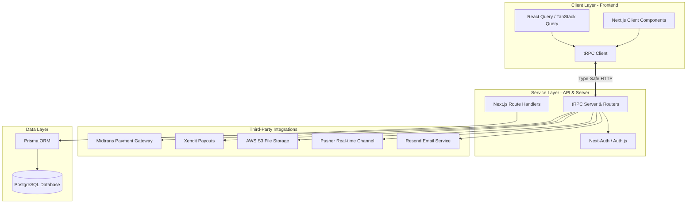
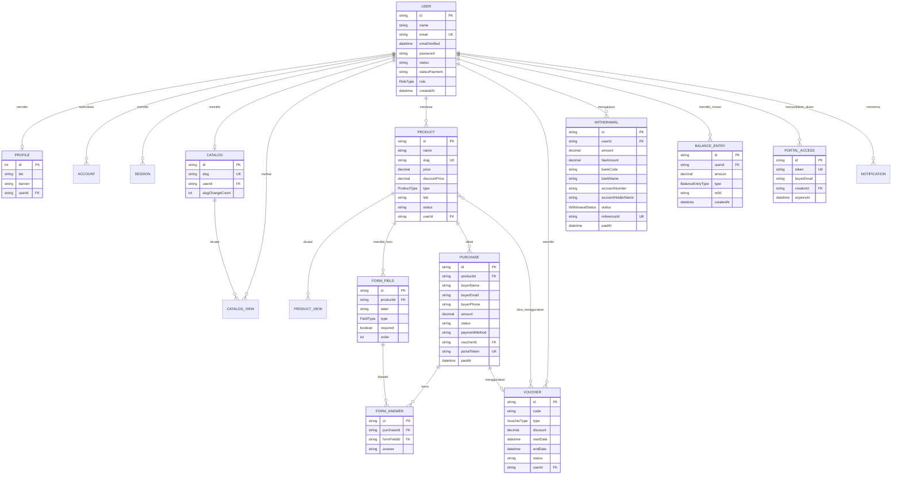
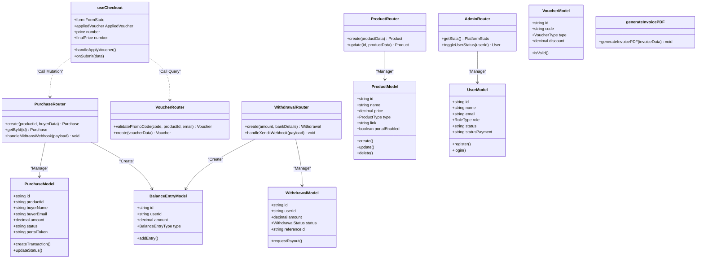
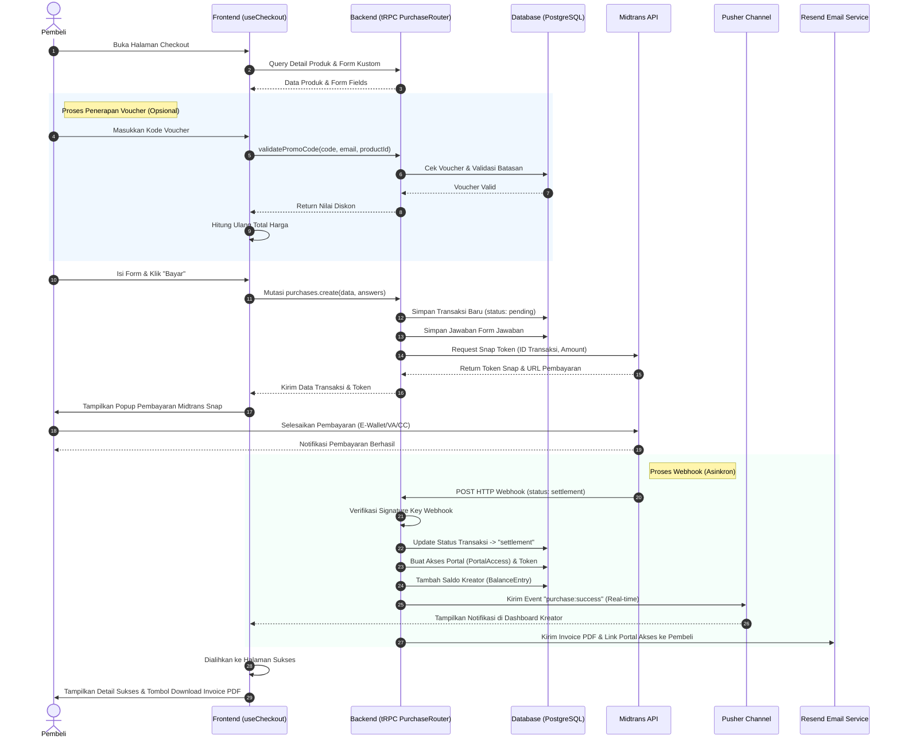
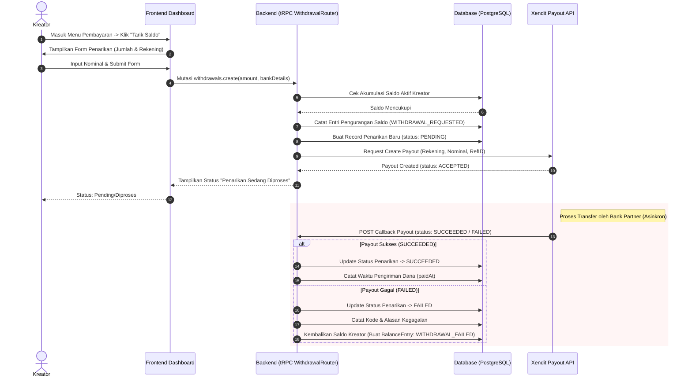
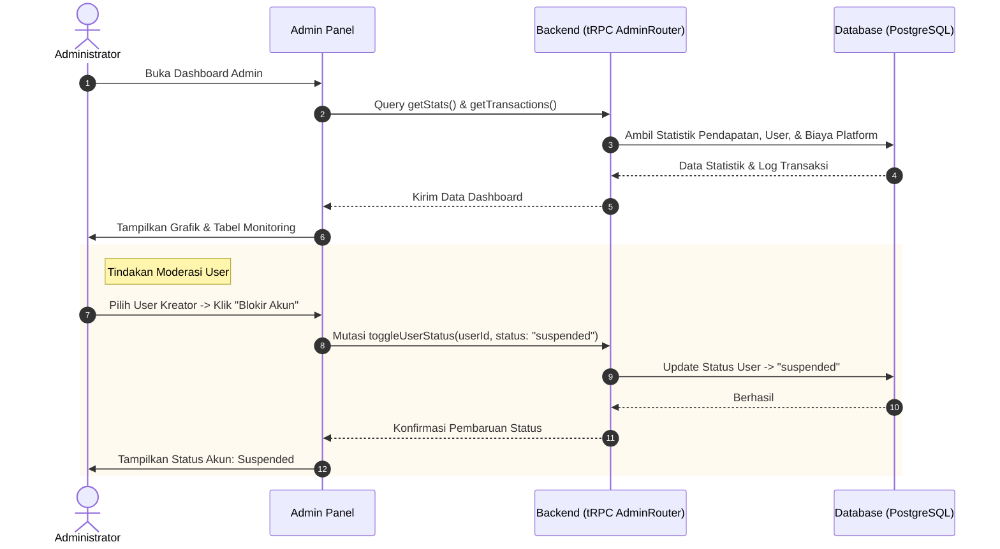
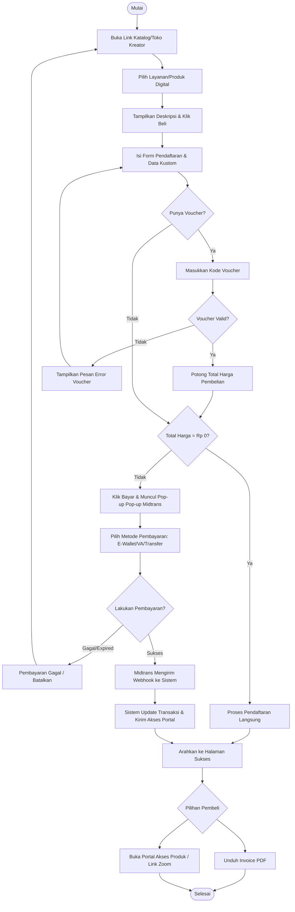
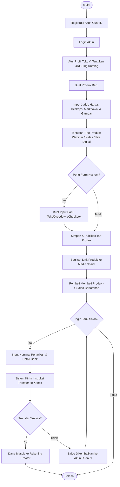
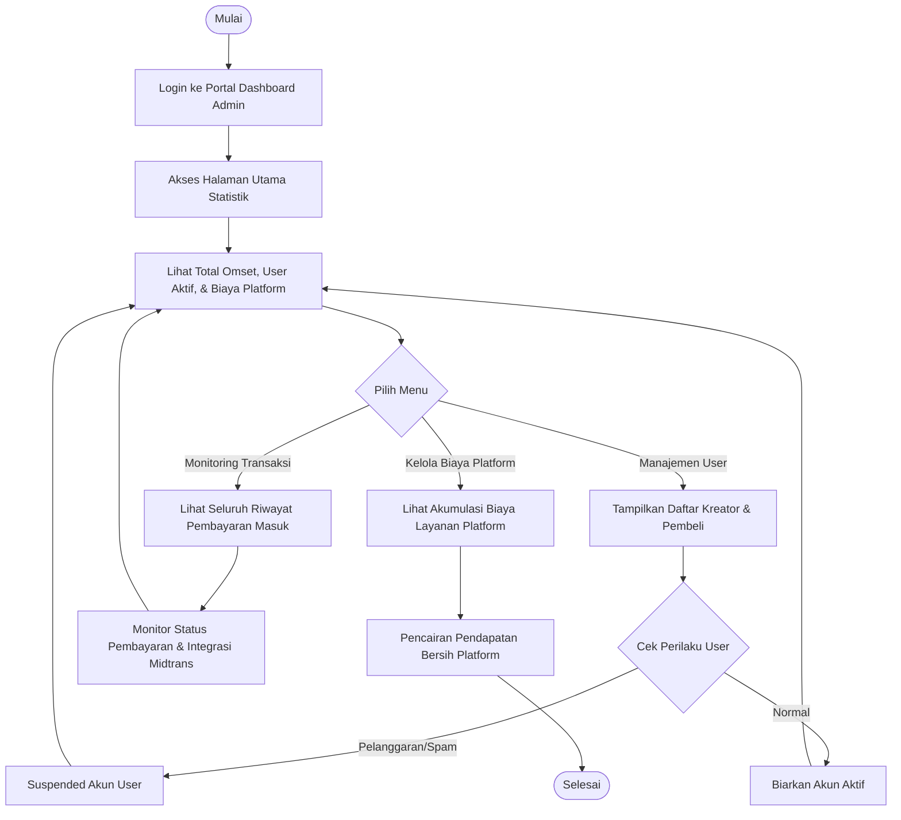

# Dokumentasi Sistem CuanIN
*Platform Penjualan Layanan Digital dan Pengelolaan Keuangan untuk Kreator*

Dokumentasi ini disusun sebagai panduan teknis dan referensi untuk laporan Tugas Akhir. Dokumen ini memuat arsitektur sistem, analisis pustaka (library) yang digunakan, kamus data database, serta pemodelan sistem menggunakan diagram (ERD, Class Diagram, Sequence Diagram, dan Flowchart).

---

## 1. Pendahuluan & Arsitektur Sistem

**CuanIN** adalah platform berbasis web yang dirancang khusus untuk memfasilitasi kreator dalam menjual layanan digital seperti Webinar, Kelas Online, dan Produk Digital langsung kepada pembeli. Platform ini mengintegrasikan sistem pembayaran otomatis (Payment Gateway) dan penarikan dana (Payout) untuk memberikan pengalaman transaksi yang mulus bagi kreator maupun pembeli.

### Arsitektur Teknologi

Sistem ini dibangun dengan arsitektur modern berbasis **Next.js App Router** dengan pola **Full-Stack Monolith**:

- **Frontend**: Menggunakan React 19 dan Next.js 15 dengan komponen UI berbasis Tailwind CSS dan Radix UI untuk performa dan antarmuka yang responsif.
- **Backend (API)**: Menggunakan **tRPC** untuk menyediakan API yang *type-safe* antara frontend dan backend tanpa perlu menulis skema REST manual.
- **Database & ORM**: Menggunakan database relasional **PostgreSQL** yang dikelola melalui **Prisma ORM** untuk query dan migrasi yang aman.
- **Autentikasi**: Menggunakan **Next-Auth (v5)** untuk mendukung autentikasi kredensial (Email & Password) dan OAuth (Google Sign-In).

---

## 2. Daftar & Analisis Library (Dependencies)

Berikut adalah daftar library utama yang digunakan pada proyek CuanIN beserta analisis fungsinya:

| Nama Library | Versi | Kategori | Fungsi Utama dalam Sistem |
| :--- | :--- | :--- | :--- |
| `next` | `^15.2.3` | Core Framework | Framework utama untuk routing (App Router), Server-Side Rendering (SSR), dan Server Actions. |
| `react` & `react-dom` | `^19.0.0` | UI Library | Library utama pembuat komponen antarmuka pengguna yang reaktif. |
| `@prisma/client` & `prisma` | `^6.6.0` | Database ORM | Object-Relational Mapping (ORM) untuk interaksi aman dengan database PostgreSQL. |
| `@trpc/server`, `client`, `react-query` | `^11.16.0` | API Layer | Menghubungkan client dan server secara langsung dengan jaminan tipe data (type-safety) TypeScript. |
| `@tanstack/react-query` | `^5.96.2` | State & Fetching | Manajemen caching, sinkronisasi state data eksternal, dan handling loading/error state. |
| `next-auth` | `^5.0.0-beta.31` | Autentikasi | Mengamankan rute (middleware) dan mengelola sesi pengguna (Google OAuth & Credentials). |
| `midtrans-client` | `^1.4.3` | Payment Gateway | Integrasi dengan Midtrans untuk memproses pembayaran instan (E-Wallet, VA, dll.) oleh pembeli. |
| `xendit` | *API Integrasi* | Payout Gateway | Digunakan melalui pemanggilan HTTP API langsung (diintegrasikan pada modul `withdrawals.ts`) untuk mengirim dana otomatis ke rekening kreator. |
| `@aws-sdk/client-s3` | `^3.893.0` | Storage Service | Mengunggah dan mengambil file media produk atau bukti transaksi dari cloud storage AWS S3 / Cloudflare R2. |
| `pusher` & `pusher-js` | `^5.3.4` | Real-time Notif | Mengirim notifikasi transaksi masuk secara real-time ke dashboard kreator tanpa reload halaman. |
| `jspdf` | `^4.2.1` | Dokumen Generator | Menghasilkan dokumen invoice digital berformat PDF langsung di sisi klien setelah pembayaran berhasil. |
| `resend` & `nodemailer` | `^6.12.4` | Email Service | Mengirimkan email konfirmasi pembayaran, link verifikasi, dan invoice elektronik kepada pembeli. |
| `zod` | `^3.24.2` | Validasi Data | Melakukan validasi skema data pada form masukan dan input API tRPC secara runtime. |
| `react-hook-form` | `^7.72.1` | Form Management | Mengelola state formulir pendaftaran, pembuatan produk, dan formulir checkout kustom. |
| `@dnd-kit/core` & `sortable` | `^6.3.1` | Drag & Drop | Mengimplementasikan fitur penyusunan ulang urutan kolom formulir kustom secara interaktif. |
| `@uiw/react-md-editor` | `^4.1.0` | Rich Text Editor | Menyediakan editor teks berbasis Markdown bagi kreator untuk menulis deskripsi detail produk mereka. |

---

## 3. Struktur Database & Kamus Data

Database CuanIN menggunakan **PostgreSQL** dengan total 17 tabel utama. Berikut adalah rincian kamus data untuk masing-masing tabel:

### 1. Tabel `User`
Menyimpan informasi utama pengguna (Kreator, Admin, maupun Pembeli umum).
*   `id` (String - CUID, PK): ID unik user.
*   `name` (String, Optional): Nama lengkap user.
*   `email` (String, Unique): Alamat email user.
*   `emailVerified` (DateTime, Optional): Waktu email berhasil diverifikasi.
*   `image` (String, Optional): URL foto profil.
*   `password` (String, Optional): Hash password user (untuk metode login kredensial).
*   `status` (String, Default: "active"): Status akun (`active`, `suspended`).
*   `statusPayment` (String, Default: "free"): Paket langganan kreator (`free`, `premium`).
*   `googleId` (String, Optional): ID unik dari Google OAuth.
*   `phoneNumber` (String, Optional): Nomor telepon.
*   `role` (RoleType, Default: USER): Hak akses user (`USER`, `CREATOR`, `ADMIN`).
*   `createdAt` & `updatedAt` (DateTime): Waktu pembuatan dan pembaruan data.

### 2. Tabel `Profile`
Menyimpan informasi tambahan profil kreator.
*   `id` (Int, PK, Autoincrement): ID unik profil.
*   `bio` (String, Optional): Deskripsi singkat profil/toko.
*   `banner` (String, Optional): URL gambar banner toko.
*   `userId` (String, FK, Unique): Menghubungkan ke tabel `User`.

### 3. Tabel `Catalog`
Merepresentasikan etalase/toko digital dari seorang kreator.
*   `id` (String - UUID, PK): ID unik katalog.
*   `slug` (String, Unique): Slug URL unik katalog (contoh: `cuanin.com/kreator-slug`).
*   `userId` (String, FK, Unique): Menghubungkan ke tabel `User`.
*   `slugChangeCount` (Int, Default: 0): Jumlah perubahan nama slug.
*   `lastSlugUpdatedAt` (DateTime, Optional): Waktu terakhir slug diubah.

### 4. Tabel `CatalogView`
Mencatat statistik kunjungan ke halaman katalog kreator.
*   `id` (String - UUID, PK): ID unik log kunjungan.
*   `catalogId` (String, FK): Menghubungkan ke tabel `Catalog`.
*   `userId` (String, FK): Menghubungkan ke pemilik katalog (`User`).
*   `visitorId` (String, Optional): ID unik pengunjung (berbasis cookie/session).
*   `ipHash` (String, Optional): Hash IP address pengunjung untuk menjaga privasi.
*   `userAgent`, `browser`, `os`, `device` (String, Optional): Metadata perangkat pengunjung.

### 5. Tabel `Product`
Menyimpan informasi produk digital yang dibuat oleh kreator.
*   `id` (String - UUID, PK): ID unik produk.
*   `name` (String): Nama produk.
*   `slug` (String, Unique): Slug URL unik produk.
*   `shortDescription` (String, Optional): Deskripsi singkat.
*   `description` (String, Optional): Deskripsi detail (format Markdown).
*   `price` (Decimal): Harga produk.
*   `discountPrice` (Decimal, Optional): Harga diskon/promo.
*   `type` (ProductType, Default: WEBINAR): Kategori produk (`WEBINAR`, `DIGITAL_PRODUCT`, `KELAS_ONLINE`).
*   `image` & `images` (String/Json, Optional): File gambar produk.
*   `link` (String, Optional): Link akses utama produk (misal: link Zoom webinar atau file drive).
*   `links` (Json, Optional): Daftar link tambahan.
*   `benefit` (Json, Optional): Daftar keuntungan produk.
*   `status` (String, Default: "published"): Status publikasi (`published`, `draft`).
*   `capacity` (Int, Optional): Kapasitas maksimal (untuk Webinar/Kelas).
*   `startDate` & `endDate` (DateTime, Optional): Jadwal pelaksanaan webinar/kelas.
*   `dateDeadline` (DateTime, Optional): Batas waktu pembelian produk.
*   `portalEnabled` (Boolean, Default: false): Mengaktifkan halaman portal khusus pembeli.
*   `userId` (String, FK): ID Kreator pemilik produk (`User`).

### 6. Tabel `ProductView`
Mencatat statistik kunjungan pada detail halaman produk tertentu.
*   `id` (String - UUID, PK): ID log kunjungan produk.
*   `productId` (String, FK): Menghubungkan ke tabel `Product`.
*   `visitorId`, `browser`, `device`, `ipHash`, `os`, `userAgent` (String, Optional): Metadata kunjungan.

### 7. Tabel `FormField`
Menyimpan konfigurasi form kustom yang harus diisi pembeli saat checkout.
*   `id` (String - UUID, PK): ID unik field form.
*   `productId` (String, FK): Menghubungkan ke tabel `Product`.
*   `label` (String): Pertanyaan/label input (misal: "Username Instagram").
*   `type` (FieldType, Default: SHORT): Tipe input (`SHORT`, `LONG`, `MULTIPLE_CHOICE`, `CHECKBOX`, `DROPDOWN`).
*   `options` (Json, Optional): Pilihan jawaban (jika tipe dropdown/pilihan ganda).
*   `required` (Boolean, Default: false): Status wajib diisi.
*   `order` (Int, Default: 0): Urutan tampil field.

### 8. Tabel `Purchase`
Mencatat seluruh transaksi pembelian produk oleh pembeli.
*   `id` (String - UUID, PK): ID unik transaksi (berfungsi sebagai ID Invoice).
*   `productId` (String, FK): Menghubungkan ke tabel `Product`.
*   `buyerName` (String): Nama lengkap pembeli.
*   `buyerEmail` (String): Email aktif pembeli.
*   `buyerPhone` (String): Nomor telepon pembeli.
*   `amount` (Decimal, Default: 0): Total nominal yang harus dibayar.
*   `status` (String, Default: "pending"): Status transaksi (`pending`, `settlement`/`paid`, `expire`, `failed`, `refund`).
*   `paidAt` (DateTime, Optional): Waktu pembayaran sukses.
*   `paymentMethod` (String, Optional): Metode pembayaran (misal: `GoPay`, `Bank Transfer - BCA`).
*   `paymentDetails` (Json, Optional): Detail respon dari Payment Gateway.
*   `voucherId` (String, FK, Optional): Voucher yang diterapkan pada transaksi.
*   `portalToken` (String, Unique, Optional): Token acak untuk memverifikasi akses pembeli ke halaman portal produk.

### 9. Tabel `FormAnswer`
Menyimpan jawaban pembeli terhadap form kustom dari produk yang dibeli.
*   `id` (String - UUID, PK): ID unik jawaban.
*   `purchaseId` (String, FK): Menghubungkan ke transaksi `Purchase`.
*   `formFieldId` (String, FK): Menghubungkan ke konfigurasi field `FormField`.
*   `answer` (String): Isi jawaban yang dimasukkan pembeli.

### 10. Tabel `Voucher`
Menyimpan data kupon potongan harga (diskon) yang dibuat oleh kreator.
*   `id` (String - UUID, PK): ID unik voucher.
*   `code` (String): Kode kupon (misal: `DISKONHEMAT`).
*   `name` (String, Optional): Nama promo.
*   `type` (VoucherType, Default: PERSEN): Jenis potongan (`PERSEN` atau `NOMINAL`).
*   `discount` (Decimal): Nilai potongan.
*   `startDate` & `endDate` (DateTime): Masa aktif kupon.
*   `status` (String, Default: "aktif"): Status kupon (`aktif`, `nonaktif`, `expired`).
*   `usageType` (String, Default: "ALL_PRODUCTS"): Ruang lingkup kupon (`ALL_PRODUCTS`, `SELECTED_PRODUCTS`).
*   `usageLimit` (Int, Optional): Batas maksimal kupon dapat digunakan.
*   `isLimitPerUser` (Boolean, Default: false): Membatasi pemakaian 1x per email pembeli.
*   `userId` (String, FK): Kreator pembuat kupon (`User`).

### 11. Tabel `Withdrawal`
Mencatat riwayat pengajuan penarikan saldo pendapatan oleh kreator.
*   `id` (String - UUID, PK): ID unik penarikan.
*   `userId` (String, FK): Kreator yang mengajukan `User`.
*   `amount` (Decimal): Nominal penarikan kotor.
*   `feeAmount` (Decimal, Optional): Biaya administrasi penarikan.
*   `bankCode` & `bankName` (String): Data bank tujuan transfer.
*   `accountNumber` & `accountHolderName` (String): Nomor rekening dan nama pemilik rekening.
*   `email` (String): Email notifikasi penarikan.
*   `status` (WithdrawalStatus, Default: PENDING): Status transfer (`PENDING`, `ACCEPTED`, `REQUESTED`, `SUCCEEDED`, `FAILED`, `CANCELLED`).
*   `referenceId` (String, Unique): ID referensi unik transaksi untuk rekonsiliasi Xendit.
*   `xenditPayoutId` (String, Optional): ID transaksi payout dari pihak Xendit.
*   `paidAt` (DateTime, Optional): Waktu dana berhasil ditransfer.
*   `failureCode` & `failureMessage` (String, Optional): Detail error jika transfer gagal.

### 12. Tabel `BalanceEntry`
Buku besar (*ledger*) pencatatan mutasi saldo (debet/kredit) pengguna.
*   `id` (String - UUID, PK): ID unik entri saldo.
*   `userId` (String, FK): User pemilik saldo (`User`).
*   `amount` (Decimal): Nilai mutasi saldo (positif untuk saldo masuk, negatif untuk keluar).
*   `type` (BalanceEntryType): Kategori mutasi (`PURCHASE_COMPLETED`, `WITHDRAWAL_REQUESTED`, `WITHDRAWAL_FAILED`, `PLATFORM_FEE_EARNED`, dll.).
*   `refId` (String, Optional): ID referensi eksternal (misal: ID Purchase atau ID Withdrawal).
*   `note` (String, Optional): Catatan deskripsi transaksi.

### 13. Tabel `PortalAccess`
Mengatur otorisasi pembeli non-login untuk mengakses halaman portal produk digital.
*   `id` (String - UUID, PK): ID unik hak akses.
*   `token` (String, Unique): Token rahasia akses portal.
*   `buyerEmail` (String): Email pembeli yang terdaftar.
*   `creatorId` (String, FK): Kreator penyedia produk (`User`).
*   `expiresAt` (DateTime): Batas waktu kedaluwarsa token akses.

### 14. Tabel `Notification`
Menyimpan pesan notifikasi sistem bagi pengguna.
*   `id` (String - UUID, PK): ID unik notifikasi.
*   `userId` (String, FK): Penerima notifikasi (`User`).
*   `title` & `message` (String): Judul dan isi notifikasi.
*   `type` (NotificationType): Kategori notifikasi (`PURCHASE`, `WITHDRAWAL`, `PRODUCT`, `SYSTEM`).
*   `refId` (String, Optional): ID referensi entitas terkait.
*   `isRead` (Boolean, Default: false): Status keterbacaan notifikasi.

### 15. Tabel `Account`, `Session`, & `VerificationToken`
Tabel standar dari Next-Auth untuk manajemen sesi login OAuth dan token verifikasi email.

---

## 4. Entity Relationship Diagram (ERD)

Berikut adalah visualisasi hubungan relasi antar tabel (Entity Relationship Diagram) dalam sistem CuanIN:

---

## 5. Class Diagram (Diagram Kelas)

Diagram kelas di bawah ini menggambarkan struktur logika dari entitas data (Prisma Models), pengendali bisnis (tRPC Routers), dan interaksi klien (React Hooks & Utilities):

---

## 6. Sequence Diagram (Diagram Sekuens)

### 1. Alur Transaksi & Pembayaran (Pembeli -> Midtrans)
Menjelaskan proses pembelian produk, pengisian formulir kustom, penerapan diskon voucher, pembuatan tagihan Midtrans, pembayaran oleh pembeli, dan penanganan webhook untuk aktivasi akses produk serta penambahan saldo kreator.

### 2. Alur Penarikan Saldo Kreator (Kreator -> Xendit)
Menjelaskan bagaimana kreator mengajukan pencairan dana dari akumulasi penjualan, sistem memotong saldo secara sementara, mengirim perintah transfer ke Xendit, dan memperbarui status berdasarkan respons webhook Xendit.

### 3. Alur Manajemen & Monitoring Admin
Menjelaskan bagaimana administrator memantau seluruh aktivitas transaksi platform, mengelola pengguna, dan menarik biaya komisi platform.

---

## 7. Flowchart (Diagram Alir)

### 1. Alur Kerja Pembeli (Buyer Flow)
Menggambarkan seluruh langkah pembeli mulai dari mengakses halaman toko kreator hingga berhasil mengunduh file/mengakses produk.

### 2. Alur Kerja Kreator (Creator Flow)
Menggambarkan langkah-langkah kerja kreator mulai dari registrasi akun, pengelolaan produk, pembuatan formulir kustom, hingga proses penarikan pendapatan ke rekening pribadi.

### 3. Alur Kerja Administrator (Admin Flow)
Menggambarkan alur kerja admin dalam memoderasi ekosistem platform, melakukan verifikasi pengguna, memantau keuangan, dan mengontrol komisi platform.

