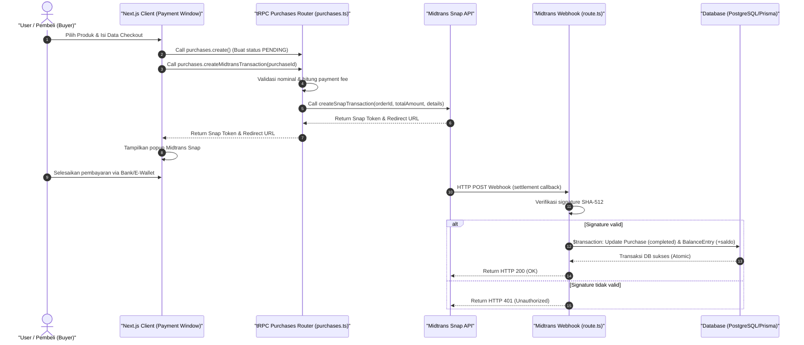

# Laporan Keamanan Sistem Pembayaran & Saldo CuanIN

Dokumen ini menjelaskan arsitektur, mekanisme pertahanan, dan kebijakan keamanan yang diterapkan pada sistem pembayaran (*payment gateway*) dan pengelolaan saldo (*ledger*) pada platform **CuanIN**.

---

## 1. Arsitektur Aliran Pembayaran (Payment Flow)

CuanIN mengintegrasikan **Midtrans Snap API** sebagai penyedia gerbang pembayaran untuk memfasilitasi transaksi secara aman dari pembeli ke kreator. Alur pembayaran dirancang untuk meminimalkan paparan data sensitif di sisi klien dan memastikan status transaksi diperbarui secara tepercaya.



---

## 2. Mekanisme Keamanan Keuangan (Ledger Design)

Keamanan integritas saldo pengguna di CuanIN dikelola menggunakan pola arsitektur **Ledger (Buku Besar)** dengan prinsip *Append-Only*, didukung oleh database relasional PostgreSQL.

### A. Tabel `BalanceEntry` (Buku Besar Keuangan)
Saldo tidak pernah disimpan sebagai satu kolom numerik sederhana di tabel `User`. Cara seperti itu rentan terhadap manipulasi tidak sah dan sulit diaudit. CuanIN menggunakan model `BalanceEntry` di [schema.prisma](file:///home/luputer/Dokumen/TA/CuanIN/prisma/schema.prisma) untuk mencatat setiap pergerakan dana masuk (kredit) dan keluar (debit) secara berurutan.

```prisma
model BalanceEntry {
  id        String           @id @default(uuid())
  userId    String
  amount    Decimal
  type      BalanceEntryType
  refId     String?          // Referensi ke ID Purchase atau Withdrawal terkait
  note      String?
  createdAt DateTime         @default(now())
  user      User             @relation(fields: [userId], references: [id], onDelete: Cascade)

  @@index([userId])
  @@index([refId])
  @@index([userId, createdAt])
}
```

Setiap perubahan saldo dicatat melalui tipe mutasi berikut pada enum `BalanceEntryType`:
* **Pemasukan (+):** `PURCHASE_COMPLETED` (pembelian sukses), `WITHDRAWAL_FAILED` (pengembalian dana akibat penarikan gagal), `PLATFORM_FEE_EARNED` (pendapatan biaya platform bagi admin).
* **Pengeluaran (-):** `WITHDRAWAL_REQUESTED` (pengajuan penarikan dana), `WITHDRAWAL_REVERSED` (penarikan fee admin dibatalkan), `ADMIN_WITHDRAWAL_REQUESTED` (admin menarik dana fee platform).

### B. Perhitungan Saldo Berbasis Agregasi
Perhitungan saldo riil dilakukan dengan melakukan agregasi penjumlahan (`SUM`) pada tabel `BalanceEntry`. Logika ini diimplementasikan di [balance.ts](file:///home/luputer/Dokumen/TA/CuanIN/src/lib/balance.ts):

$$Saldo = \sum(Pemasukan) - \sum(|Pengeluaran|)$$

Pola *Append-Only* ini menjamin adanya **Audit Trail** lengkap. Jika ada perselisihan saldo, admin dapat melacak histori transaksi secara presisi dari baris mutasi pertama hingga terakhir.

---

## 3. Pencegahan Kondisi Balapan (*Race Conditions & Double Spending*)

Salah satu ancaman terbesar pada sistem penarikan dana (*withdrawal*) adalah *Double Spending*, di mana pengguna mengeksploitasi keterlambatan pemrosesan server untuk menarik dana berkali-kali secara simultan melebihi saldo yang mereka miliki.

CuanIN menangani masalah ini dengan memanfaatkan fitur **Database Transaction (`$transaction`)** di Prisma.

### Alur Eksekusi Transaksi Penarikan Dana:
Implementasi pada [withdrawals.ts](file:///home/luputer/Dokumen/TA/CuanIN/src/server/api/routers/withdrawals.ts#L36-L140) memastikan langkah berikut berjalan secara *atomic* (semua sukses atau semua gagal):

1. **Memulai Transaksi Database:** `ctx.db.$transaction(async (tx) => { ... })`
2. **Kueri Agregasi Saldo Terkini:** Mengambil saldo terbaru menggunakan fungsi `getCreatorBalance(tx, userId)`. Operasi ini terisolasi di dalam transaksi yang sama.
3. **Validasi Kecukupan Saldo:** Memeriksa apakah `totalDeduction` (jumlah penarikan + biaya penarikan + platform fee) melebihi saldo yang tersedia. Jika tidak cukup, transaksi langsung dibatalkan (*rollback*).
4. **Pencatatan Debit Saldo:** Jika cukup, baris `Withdrawal` baru berkategori `PENDING` dibuat dan baris `BalanceEntry` baru bernilai negatif dibuat seketika untuk langsung memotong saldo pengguna.

Dengan mekanisme isolasi transaksi ini, request paralel apa pun yang dikirim secara bersamaan akan mengantre. Request pertama akan memotong saldo terlebih dahulu, sehingga request kedua akan langsung gagal di tahap validasi saldo.

---

## 4. Keamanan Integrasi Webhook & Callback API

Gerbang pembayaran (Midtrans) mengirimkan status transaksi secara asinkron melalui HTTP POST Webhook ke endpoint [route.ts](file:///home/luputer/Dokumen/TA/CuanIN/src/app/api/webhooks/midtrans/route.ts). Endpoint ini dilindungi dengan langkah-barang pengamanan ketat:

### A. Verifikasi Tanda Tangan Webhook (Signature Verification)
Webhook bersifat publik dan dapat ditembak oleh siapa saja. Oleh karena itu, server CuanIN wajib memverifikasi bahwa muatan data (*payload*) benar-benar dikirim oleh Midtrans dan belum dimodifikasi di tengah jalan. Verifikasi dilakukan dengan membuat hash SHA-512 dari kombinasi `order_id`, `status_code`, `gross_amount`, dan `MIDTRANS_SERVER_KEY`:

```typescript
const verifyString = order_id + status_code + gross_amount + env.MIDTRANS_SERVER_KEY;
const expectedSignature = crypto
  .createHash("sha512")
  .update(verifyString)
  .digest("hex");

if (signature_key !== expectedSignature) {
  return NextResponse.json({ message: "Invalid signature" }, { status: 401 });
}
```
*Jika penyerang mencoba memalsukan status pembayaran menjadi sukses (`settlement`), verifikasi akan gagal karena penyerang tidak memiliki server key Midtrans.*

### B. Proteksi Idempotensi Transaksi
Untuk mencegah eksekusi ganda jika webhook dikirim berulang kali oleh Midtrans (karena kendala jaringan atau kegagalan respons pertama), sistem CuanIN menggunakan mekanisme transaksi database yang hanya mengizinkan pembaruan status dari `pending` ke `completed` satu kali:

```typescript
await tx.purchase.update({
  where: { id: purchase.id, status: "pending" }, // Hanya update jika status saat ini masih 'pending'
  data: {
    status: "completed",
    paidAt: new Date(),
    ...
  },
});
```
Jika status transaksi sudah berubah menjadi `completed` di database, upaya pembaruan berikutnya akan melempar error dan dibatalkan, sehingga mencegah terjadinya penambahan saldo gopay/kredit berkali-kali untuk satu ID pembelian yang sama.

---

## 5. Keamanan Penarikan Saldo (Withdrawal Security)

Proses pemindahan uang keluar dari platform CuanIN ke rekening bank riil kreator dikendalikan dengan integrasi **Xendit Payout API** dan pengawasan administratif yang ketat.

### A. Pembatasan Pembelian Mandiri (*Self-Buying Prevention*)
Untuk mencegah tindak pencucian uang (*money laundering*) atau eksploitasi promo/voucher melalui akun ganda, sistem CuanIN mendeteksi dan menolak pembelian produk milik sendiri di [purchases.ts](file:///home/luputer/Dokumen/TA/CuanIN/src/server/api/routers/purchases.ts#L150-L158):
```typescript
if (
  (ctx.session?.user && ctx.session.user.id === product.userId) ||
  (input.buyerEmail && product.user?.email && input.buyerEmail.toLowerCase().trim() === product.user.email.toLowerCase().trim())
) {
  throw new TRPCError({
    code: "FORBIDDEN",
    message: "Kamu tidak bisa membeli produk milik sendiri.",
  });
}
```

### B. Otorisasi Akses API Penarikan
* API untuk mencairkan saldo bagi admin dilindungi oleh `adminProcedure` di [admin.ts](file:///home/luputer/Dokumen/TA/CuanIN/src/server/api/routers/admin.ts#L110), memastikan hanya pengguna yang terotentikasi sebagai `ADMIN` yang dapat menarik dana fee platform.
* API penarikan saldo kreator dilindungi oleh `protectedProcedure` di [withdrawals.ts](file:///home/luputer/Dokumen/TA/CuanIN/src/server/api/routers/withdrawals.ts#L18), membatasi pengguna agar hanya bisa menarik saldo milik akun mereka sendiri.

### C. Penanganan Kegagalan API Gateway (Automatic Rollback)
Saat penarikan diproses oleh Xendit Payout API, ada potensi terjadinya kegagalan jaringan atau penolakan dari sistem bank tujuan. Jika pemanggilan API Xendit gagal, sistem CuanIN akan langsung mengembalikan dana penarikan kreator secara otomatis melalui transaksi jurnal balik (menambahkan mutasi positif penyeimbang di `BalanceEntry`) untuk memastikan saldo pengguna tidak hangus secara tidak adil.

---

## 6. Ringkasan Fitur Keamanan

| Parameter Keamanan | Solusi yang Diimplementasikan | Manfaat |
| :--- | :--- | :--- |
| **Integritas Saldo** | Desain Arsitektur *Append-Only Ledger* (`BalanceEntry`) | Menyediakan *audit trail* lengkap; mencegah modifikasi saldo langsung tanpa riwayat transaksi. |
| **Race Conditions** | Transaksi Database Prisma (`$transaction`) | Menghindari serangan *Double Spending* saat penarikan saldo paralel. |
| **Spoofing Webhook** | Validasi Tanda Tangan SHA-512 Midtrans | Memastikan callback pembayaran hanya berasal dari Midtrans asli. |
| **Replay Attacks** | Proteksi Status Idempotensi (`status: "pending"`) | Mencegah penambahan saldo ganda dari pengiriman ulang callback webhook. |
| **Money Laundering** | Proteksi *Self-Buying* (Membeli produk sendiri) | Mencegah manipulasi sirkulasi uang antar akun pribadi kreator. |
| **Otorisasi API** | Prosedur tRPC Terproteksi (`protectedProcedure` / `adminProcedure`) | Membatasi tindakan penarikan saldo hanya untuk pemilik dana asli atau admin yang berwenang. |
