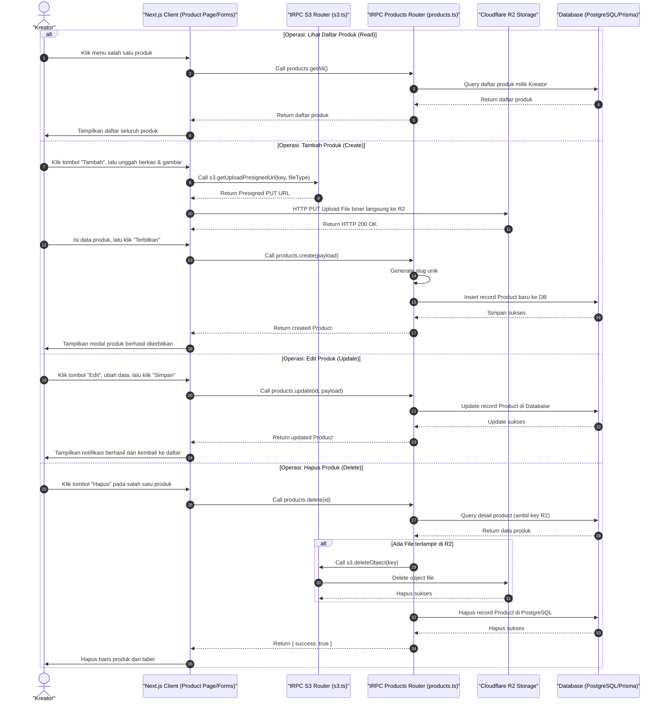
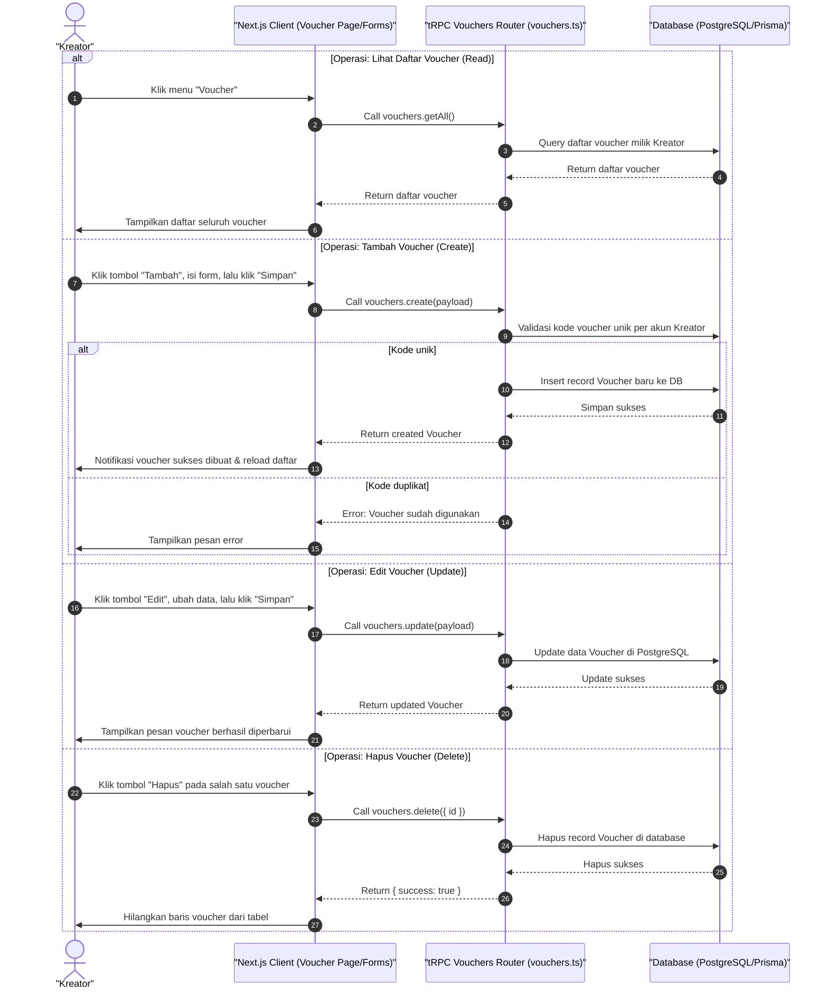
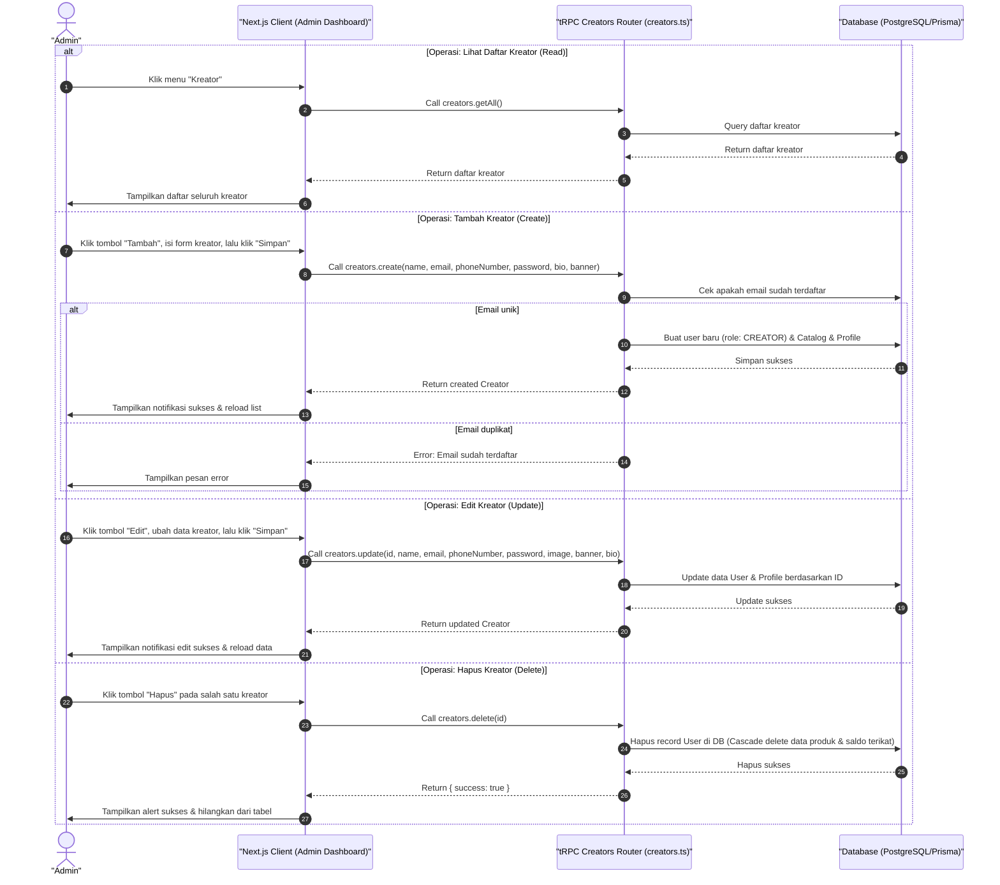

# Sequence Diagram - Kelola Produk (Kreator)

Diagram ini menjelaskan alur gabungan operasi CRUD (Lihat Daftar, Tambah, Edit, dan Hapus) Produk oleh Kreator pada platform CuanIN.

---

# Sequence Diagram - Kelola Voucher (Kreator)

Diagram ini menjelaskan alur gabungan operasi CRUD (Lihat Daftar, Tambah, Edit, dan Hapus) Voucher oleh Kreator pada platform CuanIN.

---

# Sequence Diagram - Kelola Kreator (Admin)

Diagram ini menjelaskan alur gabungan operasi CRUD (Lihat Daftar, Tambah, Edit, dan Hapus) Data Kreator oleh Admin pada platform CuanIN.

