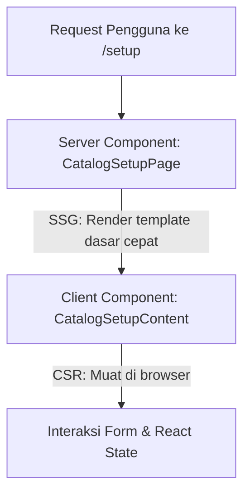

# Panduan Rendering Next.js (CSR, SSR, & SSG) pada Proyek CuanIN

Halo! Selamat belajar Next.js. Proyek **CuanIN** Anda sudah menggunakan fitur modern dari Next.js yaitu **App Router** (struktur folder `src/app`). 

Dalam Next.js App Router, pemahaman tentang **CSR (Client-Side Rendering)**, **SSR (Server-Side Rendering)**, dan **SSG (Static Site Generation)** sedikit bergeser karena adanya konsep **React Server Components (RSC)**.

Secara default, di dalam folder `src/app`, semua halaman/komponen adalah **Server Components** (berjalan di server) kecuali Anda menambahkan baris `"use client"` di paling atas file, yang menjadikannya **Client Components** (berjalan di browser).

Berikut adalah penjelasan lengkap beserta pemetaan langsung ke file-file di proyek CuanIN Anda agar lebih mudah dipahami.

---

## 1. Ringkasan Perbandingan

| Fitur | SSG (Static Site Generation) | SSR (Server-Side Rendering) | CSR (Client-Side Rendering) |
| :--- | :--- | :--- | :--- |
| **Kapan Halaman Dibuat?** | Saat proses *build* aplikasi (`npm run build`). | Setiap ada permintaan (*request*) dari pengguna. | Di browser setelah halaman kosong/template awal dimuat. |
| **Di Mana Kode Dijalankan?** | Di server (hanya sekali saat build). | Di server (setiap ada request masuk). | Di browser pengguna (client). |
| **Kecepatan Loading** | Sangat cepat (HTML sudah siap saji). | Cepat, tapi tergantung kecepatan server/database. | Terasa instan setelah aplikasi termuat, namun loading awal butuh JS. |
| **SEO Friendly?** | Sangat ramah SEO (Sempurna). | Sangat ramah SEO (Sempurna). | Kurang ramah SEO jika data bergantung pada JavaScript dinamis. |
| **Kebutuhan Database** | Data statis / tidak sering berubah. | Data dinamis yang dipersonalisasi per pengguna. | Data interaktif, form input, atau dashboard privat. |
| **Gaya di Next.js App Router** | Server Component tanpa data dinamis / dinonaktifkan caching-nya. | Server Component yang membaca data dinamis (cookies, headers, searchParams). | Komponen bertanda `"use client"`. |

---

## 2. Implementasi di Proyek CuanIN

### 💡 SSG (Static Site Generation) di CuanIN
Halaman SSG adalah halaman yang kontennya tidak berubah-ubah untuk setiap user dan tidak memerlukan data dinamis pada saat diakses. Next.js akan merender halaman ini menjadi file HTML statis saat Anda melakukan `npm run build`.

* **Ciri-ciri di Kode Anda:**
  * Komponen berupa **Server Component** (tidak ada tulisan `"use client"` di atas file).
  * Tidak menggunakan fungsi dinamis seperti `cookies()`, `headers()`, atau parameter pencarian `searchParams` dari request.
  * Biasanya mendefinisikan metadata statis untuk kebutuhan SEO.

* **Contoh di CuanIN:**
  * **Halaman Landing Page:** [src/app/page.tsx](file:///home/luputer/Dokumen/TA/CuanIN/src/app/page.tsx)
    Di file ini, Anda mengimpor komponen statis seperti `HeroSection`, `FeaturesSection`, dan `FAQSection`. Next.js tahu halaman ini tidak membutuhkan data dari session user yang sedang aktif atau cookies saat render pertama, sehingga halaman ini langsung di-generate menjadi HTML statis yang sangat cepat dibuka.
  * **Halaman Setup Wrapper:** [src/app/(catalog)/setup/page.tsx](file:///home/luputer/Dokumen/TA/CuanIN/src/app/%28catalog%29/setup/page.tsx)
    File ini hanya bertugas mengembalikan `<CatalogSetupContent />`. Karena file wrapper ini tidak melakukan fetch data dinamis di server, ia dirender secara statis (SSG), sedangkan interaksi di dalamnya ditangani oleh client component.

---

### 🧪 CSR (Client-Side Rendering) di CuanIN
CSR terjadi ketika browser mengunduh template HTML minimal beserta JavaScript, kemudian JavaScript tersebut mengambil data dan menyusun tampilan langsung di laptop/HP pengguna.

* **Ciri-ciri di Kode Anda:**
  * Wajib diawali dengan baris `"use client";` di paling atas file.
  * Menggunakan React hooks untuk menyimpan state dan efek: `useState`, `useEffect`, `useMemo`, `useRef`.
  * Menggunakan API browser seperti `localStorage`, `window`, atau `navigator.clipboard`.
  * Melakukan fetch data di sisi client, dalam proyek Anda menggunakan **tRPC client query** (seperti `api.purchases.getPurchaseHistoryByToken.useQuery`).

* **Contoh di CuanIN:**
  * **Halaman Portal Dashboard:** [src/app/portal/dashboard/page.tsx](file:///home/luputer/Dokumen/TA/CuanIN/src/app/portal/dashboard/page.tsx)
    Halaman ini menggunakan `"use client"`. Di sini Anda menggunakan:
    * `useState` untuk menyimpan tab aktif (`activeTab`), teks pencarian (`search`), dan urutan data (`sortOrder`).
    * `useEffect` untuk memeriksa `localStorage` (`localStorage.getItem("history_access_token")`) yang hanya ada di browser.
    * `api.purchases.getPurchaseHistoryByToken.useQuery` untuk mengambil data riwayat pembelian secara dinamis setelah halaman dimuat di browser.
  * **Halaman Detail Kelas (Edit):** [src/app/(creator)/kelas/[id]/page.tsx](file:///home/luputer/Dokumen/TA/CuanIN/src/app/%28creator%29/kelas/%5Bid%5D/page.tsx)
    Halaman pengeditan kelas ini menggunakan `"use client"` karena membutuhkan interaksi pengguna yang instan (validasi form, tombol tambah/hapus link akses secara interaktif, salin link menggunakan `navigator.clipboard`, dan penanganan unggah file gambar).

---

### 🖥️ SSR (Server-Side Rendering / Dynamic Rendering) di CuanIN
Dalam Next.js App Router, SSR terjadi secara otomatis ketika sebuah **Server Component** membutuhkan data yang hanya diketahui saat ada request masuk (seperti siapa user yang sedang masuk, apa isi cookies-nya, atau apa isi query string di URL).

* **Ciri-ciri di Kode Anda:**
  * Komponen berupa **Server Component** (tanpa `"use client"`).
  * Membaca cookies menggunakan `cookies()` atau headers menggunakan `headers()`.
  * Membaca properti `searchParams` yang dikirim dari URL secara dinamis.
  * Mengambil data langsung dari database menggunakan Prisma (`db.user.findUnique`) di sisi server tanpa melalui API route perantara.

* **Contoh di CuanIN:**
  * **Route Handlers / API Checkout Logout:** [src/app/api/checkout/logout/route.ts](file:///home/luputer/Dokumen/TA/CuanIN/src/app/api/checkout/logout/route.ts)
    Ketika user mengakses route ini, server harus membaca cookie session saat itu juga:
    ```typescript
    const cookieStore = await cookies();
    ```
    Karena bergantung pada `cookies()`, Next.js menandakan route ini sebagai **Dynamic Rendering (SSR)**.
  * **Middleware Proteksi Rute:** [src/middleware.ts](file:///home/luputer/Dokumen/TA/CuanIN/src/middleware.ts)
    Meskipun bukan halaman web biasa, middleware ini berjalan di server untuk setiap request untuk memeriksa token session (`NextAuth`). Ini merupakan bagian dari siklus SSR di mana server memutuskan apakah user boleh mengakses halaman tertentu atau harus di-redirect ke halaman login `/sign-in`.

---

## 🏗️ Pola Gabungan: Server + Client Components
Dalam proyek nyata seperti CuanIN, Anda akan sering melihat pola gabungan di mana halaman luarnya adalah **Server Component (SSG/SSR)** sedangkan komponen interaktif di dalamnya adalah **Client Component (CSR)**.

Mari kita lihat contoh pada halaman **Setup Katalog**:



1. **Halaman Luar:** [src/app/(catalog)/setup/page.tsx](file:///home/luputer/Dokumen/TA/CuanIN/src/app/%28catalog%29/setup/page.tsx)
   * Berfungsi sebagai **Server Component (SSG)**.
   * Mendefinisikan metadata statis untuk SEO (`title: "Setup Katalog - CuanIN"`).
   * Menampilkan komponen `<CatalogSetupContent />`.
2. **Komponen Dalam:** [src/app/(catalog)/setup/setup-content.tsx](file:///home/luputer/Dokumen/TA/CuanIN/src/app/%28catalog%29/setup/setup-content.tsx)
   * Menggunakan `"use client"` (CSR).
   * Menangani interaksi input form, tombol klik, dan animasi yang tidak bisa dilakukan di server.

---

## 🎯 Kapan Harus Menggunakan yang Mana?

1. **Gunakan SSG jika:**
   * Halaman tersebut jarang berubah kontennya (misalnya: Landing page, halaman FAQ, Syarat & Ketentuan, Blog).
   * Kecepatan muat dan SEO adalah prioritas utama Anda.

2. **Gunakan SSR jika:**
   * Halaman harus menampilkan data ter-update setiap detik yang sensitif terhadap waktu (misalnya: Halaman stok barang real-time).
   * Halaman membutuhkan autentikasi langsung di server sebelum konten dikirim ke browser (untuk mencegah kedipan/flicker layout saat memeriksa session).

3. **Gunakan CSR jika:**
   * Halaman di dalam dashboard yang terproteksi login (di mana SEO tidak penting).
   * Halaman memiliki banyak interaksi pengguna yang kompleks seperti form bertingkat, drag-and-drop, chart interaktif, atau modal pop-up.
   * Data diambil secara asinkron setelah halaman termuat menggunakan library fetching seperti SWR, React Query (tRPC), atau `useEffect`.
