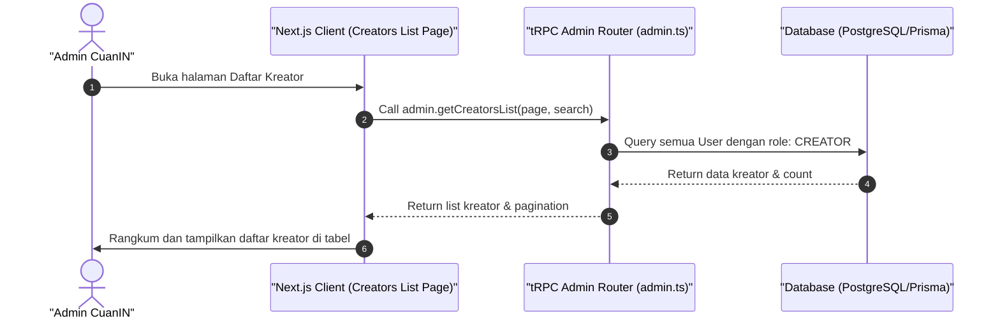

# Sequence Diagram - Lihat Daftar Kreator (Admin)

Diagram ini menjelaskan alur kasus penggunaan (use case) ke-2: **Lihat Daftar Kreator (Admin)** pada platform CuanIN.

### Detail Langkah / Deskripsi Alur:

Admin membuka basis data pengguna yang memiliki hak akses sebagai Kreator untuk diawasi.
