# Use Case Diagram - CuanIN

Dokumen ini berisi diagram kasus penggunaan (Use Case Diagram) lengkap untuk platform **CuanIN** yang melibatkan 3 Aktor utama: **Admin**, **Kreator/Penjual**, dan **User/Pembeli** dengan total 51 use case.

## Diagram Kasus Penggunaan (Mermaid Flowchart)

```mermaid
flowchart LR
    %% Actors definition
    subgraph Actors ["Aktor Utama"]
        Admin((Admin))
        Creator((Kreator / Penjual))
        Buyer((User / Pembeli))
    end

    %% System Boundary
    subgraph System ["Batas Sistem CuanIN"]
        %% Admin Use Cases
        subgraph AdminUC ["Kasus Penggunaan Admin (14)"]
            a1([Lihat Dashboard Admin])
            a2([Lihat Daftar Kreator])
            a3([Tambah Kreator])
            a4([Edit Kreator])
            a5([Hapus Kreator])
            a6([Lihat Daftar Produk Kreator])
            a7([Lihat Detail Produk Kreator])
            a8([Lihat Daftar Semua Produk])
            a9([Lihat Detail Produk])
            a10([Lihat Daftar Transaksi Admin])
            a11([Lihat Detail Transaksi Admin])
            a12([Konfirmasi Tarik Saldo])
            a13([Edit Profil Admin])
            a14([Lihat Notifikasi Admin])
        end

        %% Creator Use Cases
        subgraph CreatorUC ["Kasus Penggunaan Kreator (29)"]
            c1([Registrasi Akun Kreator])
            c2([Lihat Dashboard Kreator])
            c3([Lihat Daftar Produk Kreator])
            c4([Tambah Produk])
            c5([Edit Produk])
            c6([Hapus Produk])
            c7([Kustomisasi Form])
            c8([Lihat Daftar Pembeli])
            c9([Lihat Detail Pembeli])
            c10([Export Data Pembeli ke Excel])
            c11([Lihat Daftar User])
            c12([Lihat Detail User])
            c13([Lihat Daftar Transaksi Kreator])
            c14([Lihat Detail Transaksi Kreator])
            c15([Tarik Saldo])
            c16([Lihat Daftar Voucher])
            c17([Tambah Voucher])
            c18([Edit Voucher])
            c19([Hapus Voucher])
            c20([Edit Profil Kreator])
            c21([Lihat Notifikasi Kreator])
            
            %% Shared with Buyer but scoped
            c22([Lihat Katalog Kreator])
            c23([Lihat Detail Katalog])
            c24([Daftar / Checkout])
            c25([Bayar Produk])
            c26([Akses Produk Lewat Email])
            c27([Akses Produk Lewat Portal])
            c28([Lihat Riwayat Pembelian Kreator])
            c29([Cetak Invoice Kreator])
        end

        %% Buyer Use Cases
        subgraph BuyerUC ["Kasus Penggunaan Pembeli (8)"]
            b1([Lihat Katalog])
            b2([Lihat Detail Katalog])
            b3([Daftar / Checkout])
            b4([Bayar Produk])
            b5([Akses Produk Lewat Email])
            b6([Akses Produk Lewat Portal])
            b7([Lihat Riwayat Pembelian])
            b8([Cetak Invoice])
        end
    end

    %% Actor to Use Case Relationships
    Admin === a1 & a2 & a3 & a4 & a5 & a6 & a7 & a8 & a9 & a10 & a11 & a12 & a13 & a14
    
    Creator === c1 & c2 & c3 & c4 & c5 & c6 & c7 & c8 & c9 & c10 & c11 & c12 & c13 & c14 & c15 & c16 & c17 & c18 & c19 & c20 & c21 & c22 & c23 & c24 & c25 & c26 & c27 & c28 & c29

    Buyer === b1 & b2 & b3 & b4 & b5 & b6 & b7 & b8

    %% Style definition
    style Admin fill:#f9f,stroke:#333,stroke-width:2px
    style Creator fill:#bbf,stroke:#333,stroke-width:2px
    style Buyer fill:#bfb,stroke:#333,stroke-width:2px
```

---

## Daftar Lengkap Kasus Penggunaan (51 Use Cases)

### 1. Aktor: Admin (14 Use Cases)
Admin bertanggung jawab penuh atas pengawasan platform, manajemen kreator, peninjauan produk, pelacakan transaksi global, dan persetujuan pengiriman saldo (Xendit Payout).
1. **Lihat Dashboard**: Melihat rangkuman analitik platform global (total pendapatan platform fee, saldo kas, total transaksi).
2. **Lihat Daftar Kreator**: Melihat semua daftar akun pengguna yang memiliki role `CREATOR`.
3. **Tambah Kreator**: Mendaftarkan akun kreator baru secara langsung dari dashboard admin.
4. **Edit Kreator**: Mengubah status atau profil kreator (misal memblokir/mengaktifkan kembali akun).
5. **Hapus Kreator**: Menghapus akun kreator dari database secara permanen.
6. **Lihat Daftar Produk Kreator**: Melihat daftar produk digital, kelas, dan webinar milik kreator tertentu.
7. **Lihat Detail Produk Kreator**: Melihat rincian informasi dan status produk milik kreator.
8. **Lihat Daftar Semua Produk**: Melihat katalog seluruh produk yang diterbitkan di platform CuanIN.
9. **Lihat Detail Produk**: Melihat rincian informasi produk tertentu dari sisi admin.
10. **Lihat Daftar Transaksi**: Pelacakan riwayat transaksi pembelian pembeli di seluruh platform.
11. **Lihat Detail Transaksi**: Melihat detail metode pembayaran, rincian biaya, dan status settlement transaksi.
12. **Konfirmasi Tarik Saldo**: Menyetujui atau menolak permintaan penarikan saldo kreator (memicu API Payout Xendit).
13. **Edit Profil**: Mengubah nama, email, password, dan informasi kontak akun admin.
14. **Lihat Notifikasi**: Menerima pemberitahuan real-time terkait pengajuan penarikan saldo baru dari kreator.

---

### 2. Aktor: Kreator / Penjual (29 Use Cases)
Kreator adalah pengguna yang menjual produk digital, webinar, atau kelas online, mengelola voucher diskon, dan menarik pendapatan mereka.
1. **Registrasi Akun**: Mendaftarkan diri menjadi Kreator baru melalui kredensial/Google SSO.
2. **Lihat Dashboard**: Memantau analitik penjualan, pengunjung katalog, os/browser pengunjung, rasio konversi, dan saldo aktif.
3. **Lihat Daftar Produk**: Mengakses semua produk digital, kelas online, dan webinar yang telah dibuat.
4. **Tambah Produk**: Menerbitkan produk baru (Digital, Webinar, Kelas Online) dengan upload media ke Cloudflare R2.
5. **Edit Produk**: Mengubah informasi harga, deskripsi, link download, atau status produk (published/unpublished).
6. **Hapus Produk**: Menghapus produk dan aset digital yang terkait di Cloudflare R2.
7. **Kustomisasi Form**: Membuat form checkout dinamis (short text, dropdown, checkbox) untuk mengumpulkan jawaban pembeli.
8. **Lihat Daftar Pembeli**: Melihat daftar pelanggan yang telah membeli produk milik kreator.
9. **Lihat Detail Pembeli**: Melihat informasi kontak dan jawaban form kustom dari pembeli.
10. **Export Data Pembeli ke Excel**: Mengunduh data daftar pembeli dalam format file spreadsheet Excel.
11. **Lihat Daftar User**: Mengakses informasi dasar pembeli yang terdaftar di bawah tokonya.
12. **Lihat Detail User**: Melihat riwayat pembelian user tertentu.
13. **Lihat Daftar Transaksi**: Memantau riwayat transaksi masuk (pending/completed) atas produk-produknya.
14. **Lihat Detail Transaksi**: Melihat rincian pembayaran, waktu transaksi, dan potongan platform fee.
15. **Tarik Saldo**: Mengajukan penarikan dana (withdrawal) ke rekening bank terdaftar.
16. **Lihat Daftar Voucher**: Melihat daftar kupon diskon/voucher aktif dan tidak aktif.
17. **Tambah Voucher**: Membuat voucher diskon baru (persentase/nominal) dengan batas waktu dan limit penggunaan.
18. **Edit Voucher**: Mengubah status, nominal diskon, atau kuota voucher.
19. **Hapus Voucher**: Menghapus voucher agar tidak bisa digunakan lagi oleh pembeli.
20. **Edit Profil**: Mengubah nama, bio katalog, banner toko, email, dan password.
21. **Lihat Notifikasi**: Menerima notifikasi pusher real-time (suara & alert) ketika ada pembelian sukses atau penarikan berhasil.
22. **Lihat Katalog**: Melihat preview tampilan katalog publik miliknya sendiri (`/catalog/[username]`).
23. **Lihat Detail Katalog**: Melihat tampilan produk tertentu dalam katalog publiknya.
24. **Daftar (Checkout)**: Membeli produk miliknya sendiri untuk keperluan testing (opsi testing bypass).
25. **Bayar**: Melakukan simulasi pembayaran produk jika membeli produk.
26. **Akses Produk Lewat Email**: Menerima email notifikasi pembelian yang berisi link akses produk/unduhan.
27. **Akses Produk Lewat Portal**: Membuka link portal akses pembeli yang otomatis terbuat untuk produk miliknya.
28. **Lihat Riwayat Pembelian**: Melihat riwayat pembelian produk jika bertindak sebagai pembeli.
29. **Cetak Invoice**: Mengunduh invoice berformat PDF untuk pembelian produk.

---

### 3. Aktor: User / Pembeli (8 Use Cases)
User adalah pelanggan akhir (buyer) yang membeli produk dari kreator melalui katalog.
1. **Lihat Katalog**: Mengunjungi halaman katalog publik kreator (`/catalog/[username]`) untuk melihat produk.
2. **Lihat Detail Katalog**: Membuka detail informasi produk sebelum membelinya.
3. **Daftar (Checkout)**: Mengisi form checkout (nama, email, nomor HP, voucher, dan jawaban form kustom).
4. **Bayar**: Membayar tagihan transaksi menggunakan metode yang dipilih (VA Bank, QRIS, e-Wallet) via Midtrans.
5. **Akses Produk Lewat Email**: Mendapatkan kiriman email berisi link download produk digital / link gabung webinar.
6. **Akses Produk Lewat Portal**: Masuk ke portal akses (`/portal/[token]`) untuk melihat seluruh link produk secara terpusat.
7. **Lihat Riwayat Pembelian**: Meminta OTP email untuk memverifikasi diri dan melihat daftar transaksi historis.
8. **Cetak Invoice**: Mengunduh file invoice PDF resmi sebagai bukti pembayaran.
